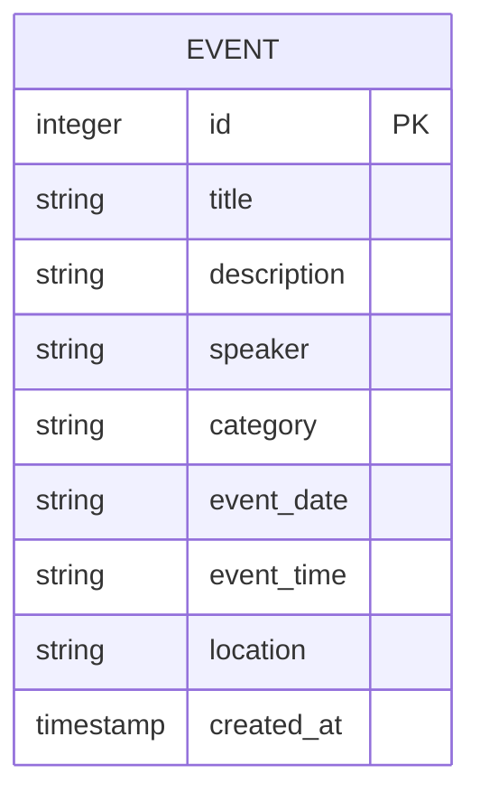

# ✦ CosmicEvents: Conference Event Tracker

Welcome to **CosmicEvents**, a premium, highly-secure, and visually breathtaking web application designed to track, schedule, and filter conference sessions and schedules. 

Designed with a high-end **"Cosmic Eclipse" Glassmorphic Theme**, this application is optimized for both readability and performance, while implementing strict security mitigations against common web vulnerabilities.

---

## 🎨 Design System & UI Theme

CosmicEvents uses a premium dark mode layout utilizing CSS custom properties for uniform, maintainable styling:

*   **Theme Name**: "Cosmic Eclipse"
*   **Colors**:
    *   Deep Space Background: `#060214` with radiant radial glows.
    *   Neon Purple Accent: `#a855f7` (used for primary actions & branding).
    *   Neon Cyan Accent: `#06b6d4` (used for search highlights & speaker badges).
    *   Neon Magenta Accent: `#ec4899` (used for locations and error highlights).
*   **Visual Assets**:
    *   **Glassmorphism Cards**: Standardized using `backdrop-filter: blur(12px) saturate(180%)` with ultra-thin translucent borders.
    *   **Interactive Focus States**: Form elements and action buttons transition smoothly with custom cubic-bezier timing curves and soft box-shadow glows.

---

## 🔒 Security & Hardening Architecture

In compliance with strict corporate and secure web guidelines (`mandatory-secure-web-skills`), CosmicEvents is built with a **fail-safe design** and zero-trust data flow:

### 1. Anti-SQL Injection (SQLi)
*   The application accesses its **SQLite** layer exclusively using **parameterized queries** with placeholder arguments (`?`). 
*   No query strings are ever formed via concatenation or string formatting.

### 2. Anti-Cross-Site Scripting (XSS)
*   **Template Auto-escaping**: All dynamically rendered server data is automatically escaped using Jinja2 templates.
*   **Safe DOM Manipulation**: The client-side interactive engine (`static/js/main.js`) handles event card sorting and search filters using safe properties like `textContent` and `classList`. Dangerous methods like `innerHTML`, `outerHTML`, or `insertAdjacentHTML` are completely avoided.

### 3. Cross-Site Request Forgery (CSRF) Mitigation
*   Every state-changing submission (such as proposing an event via POST) must include a cryptographically random, session-backed **CSRF Token**.
*   Submissions lacking a valid token fail close and return a `403 Forbidden` response.

### 4. Hardened Security Headers
All server responses are automatically decorated with security-focused HTTP headers:
*   `X-Frame-Options: DENY` (Clickjacking mitigation)
*   `X-Content-Type-Options: nosniff` (MIME sniffing prevention)
*   `Content-Security-Policy`: Standardized to strictly load assets from self and safe fonts:
    ```http
    default-src 'self'; style-src 'self' 'unsafe-inline' https://fonts.googleapis.com; font-src 'self' https://fonts.gstatic.com; script-src 'self'; frame-ancestors 'none';
    ```

---

## 🛠 Technology Stack

*   **Backend**: Python 3 (Flask)
*   **Database**: SQLite
*   **Frontend**: HTML5, Vanilla CSS3 (Custom Grid Layouts & Variables), and Vanilla JavaScript
*   **Testing**: Python `unittest` library

---

## 📂 Repository File Structure

```text
conference_event_tracker/
├── app.py                      # Flask Server, Database Setup & Security Filters
├── requirements.txt            # Package Dependencies (Flask)
├── test_app.py                 # Automated Unit Test Suite
├── README.md                   # Project Documentation
├── static/
│   ├── css/
│   │   └── styles.css          # Cosmic Eclipse Custom Stylesheet
│   └── js/
│       └── main.js             # Secure Real-Time Filtering & Client Actions
└── templates/
    ├── base.html               # Shared Master Layout (Typography, Navigation)
    ├── index.html              # Event Dashboard & Real-Time Search Timelines
    ├── add_event.html          # Secure Form to Propose Sessions
    └── error.html              # Interactive Customized Error Pages
```

---

## 💾 Database Schema

The SQLite schema automatically initializes the `events` table on server startup:



| Column | Data Type | Constraints | Description |
| :--- | :--- | :--- | :--- |
| `id` | INTEGER | PRIMARY KEY AUTOINCREMENT | Unique sequence key |
| `title` | TEXT | NOT NULL | Title of the session |
| `description` | TEXT | NOT NULL | Abstract of topics and goals |
| `speaker` | TEXT | NOT NULL | Presenter's full name |
| `category` | TEXT | NOT NULL | Track (e.g. AI & Deep Learning, Cybersecurity) |
| `event_date` | TEXT | NOT NULL | Date formatted as `YYYY-MM-DD` |
| `event_time` | TEXT | NOT NULL | Start time formatted as `HH:MM` |
| `location` | TEXT | NOT NULL | Stage name, room, stage, or online link |
| `created_at` | TIMESTAMP | DEFAULT CURRENT_TIMESTAMP | Record insertion timestamp |

---

## 🚀 Installation & Local Execution

Follow these step-by-step instructions to get the tracker up and running locally.

### Prerequisites
*   Python 3.8 or higher installed on your machine.

### Step 1: Clone and Navigate to Directory
```bash
cd conference_event_tracker
```

### Step 2: Create and Activate Virtual Environment
```bash
python3 -m venv venv
source venv/bin/activate
```

### Step 3: Install Required Dependencies
All dependencies are downloaded cleanly from the mirror source:
```bash
pip install -r requirements.txt
```

### Step 4: Run Automated Verification Tests
Validate the application's integrity before initiating the engine:
```bash
python3 -m unittest test_app.py
```
*Expected Output:*
```text
Ran 8 tests in 0.052s
OK
```

### Step 5: Start the Flask Development Server
```bash
python3 app.py
```
On start, the database file `events.db` will be created automatically in your directory and pre-populated with three default premium sessions.

*   Access the local portal: **[http://127.0.0.1:5000](http://127.0.0.1:5000)**

---

## 🧪 Detailed Test Case Scenarios

The test framework in `test_app.py` enforces regressions and compliance:

1.  **`test_database_initialization`**: Asserts that `events.db` seeds three premium events on first run.
2.  **`test_dashboard_route_get`**: Verifies status code 200 and checks for key layout texts (Cosmic Events) and populated session fields.
3.  **`test_add_event_route_get`**: Validates form load and confirms presence of HTML5 date pickers and hidden CSRF protection variables.
4.  **`test_add_event_post_without_csrf_is_blocked`**: Asserts that submissions lacking a token fail immediately with a `403 Forbidden` response.
5.  **`test_add_event_post_with_valid_data_and_csrf_succeeds`**: Verifies that a valid POST submission successfully persists to the database and redirects with a success flash card.
6.  **`test_add_event_post_validation_error`**: Asserts that sending malformed inputs (e.g., date formatted as a plain string, short abstracts) responds with `400 Bad Request` and highlights fields needing correction.
7.  **`test_custom_error_handlers`**: Tests custom `404 Not Found` templates when accessing non-existent routes.
8.  **`test_security_headers_present`**: Verifies all HTTP responses block frame-ancestors, content sniffing, and enforce the CSP whitelist.
